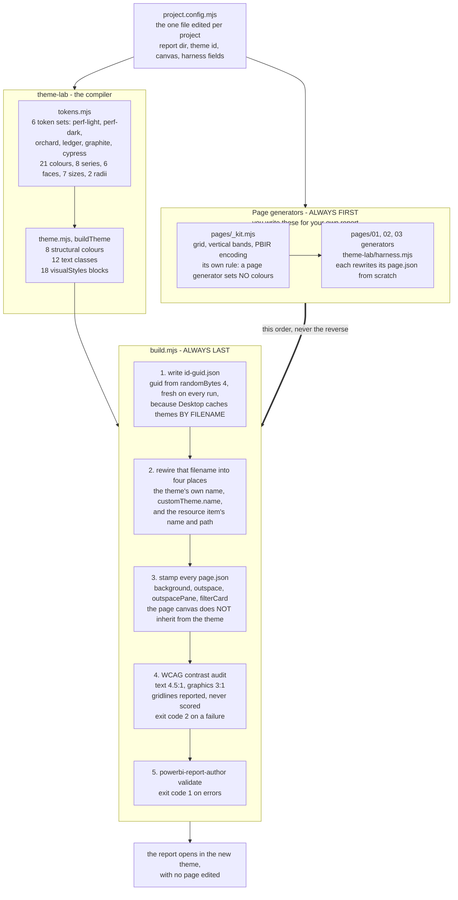
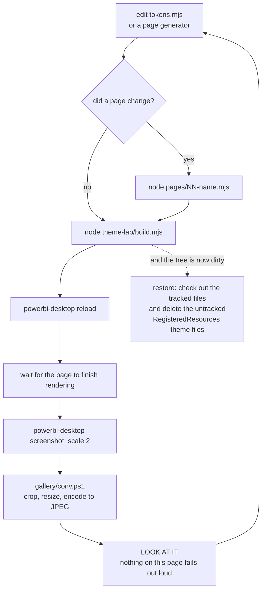
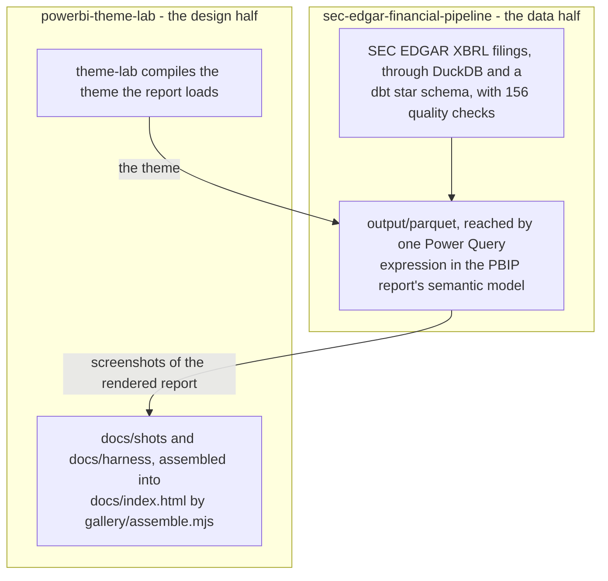

# How it works

Three diagrams, one worked calculation and a strip of screenshots. Together they answer what the
gallery raises and does not: what compiles what, in which order the commands have to run, and where
the contrast numbers come from.

Everything drawn below is checked against the code. Every flag and every count is as drawn, and
every file named in a box exists here — with one exception, marked in the diagram where it occurs.
The page-generator lane is the layer you write for your own report, so it is drawn to show where it
sits in the order, not because it ships here. Section 10 of
[`theme-lab/README.md`](theme-lab/README.md#10-where-the-report-itself-gets-designed) has a worked
example of one.

**What you need to run any of it.** Node, and nothing installed beyond it: these scripts import only
what Node ships with, and the repository has no `package.json` because it has no dependencies. A
PBIP project, for the two scripts that rewire a report. Microsoft's `powerbi-report-author` for the
validation step, which `build.mjs --no-validate` skips if you do not have it, and `powerbi-desktop`
for the reload-and-screenshot loop in diagram 2. Any PBIP project will do — nothing here is specific
to the report that happens to be screenshotted.

## 1. The compiler, and the lane beside it

`theme-lab/` is a compiler: design tokens in, a complete Power BI theme JSON out, with a WCAG
contrast audit on every colour pair it produces. Six token sets are defined, so the same report has
six sets of clothes and no page is ever edited to change between them.

Beside the compiler runs a second lane, the page generators, and the whole reason this diagram
exists is the thick arrow between them.



**Why the order is the point.** A page generator writes its `page.json` from scratch, and step 3
above is what puts the canvas colour into that same file. Run the generator after `build.mjs` and
the stamp is gone: the page then renders on Power BI's default grey, `validate` still reports zero
errors, and nothing anywhere says why. Generator first, `build.mjs` last, every time.

**Which constraints are Power BI's, and which are ours.** The two get told in the same breath
above, so here they are apart. The left column is the platform, and none of it is negotiable. The
right is this repository's judgement, and could reasonably have gone another way.

| Power BI imposes it | We chose it |
|---|---|
| Desktop caches a theme **by filename**, so a rewritten file under the same name keeps showing the old theme | Rotating the filename on every build, rather than asking anyone to clear a cache |
| A page's canvas colour does **not** inherit from the theme's structural background | Stamping it into every `page.json` from `build.mjs`, so no page carries a hand-set colour |
| `validate` passes a page that lost its background, and a mistyped property is discarded in silence | Treating screenshots as the test, and never trusting a clean validation as evidence |
| A colour set on a visual always beats the theme | Forbidding inline colour outright, including in the harness |
| A report cannot switch theme while someone is looking at it | One project, one theme; the six exist to be chosen between, not shipped together |
| — | Gridline pairs are reported but never scored: a gridline is meant to be nearly invisible |
| — | The harness lives in `docs/harness/`, apart from the eighteen gallery renders |

**What is committed here, and what is not.** `tokens.mjs` and `theme.mjs` are the compiler and they
run in this repository unaided. `build.mjs` and `harness.mjs` do not: they rewire a PBIR report, and
no report is committed here. The `pages/` lane is empty for the same reason, and because it is the
one part nobody can write for you: which pages exist and what goes on them is the report. The folder
is committed anyway, with nothing in it, so the slot the diagram draws is a real place on disk. That is
also why `project.config.mjs` sits beside `theme-lab/` rather than inside it - nothing
report-specific is allowed to live in the folder that gets copied between projects.

## 2. The loop this is worked in

Changing a colour is one edit and five commands. The last step is the one that matters, and it is
not a command.



**The wait is not padding.** A matrix and a table are the slowest visuals on a page, and a
screenshot taken too soon after a reload catches them mid-render: the rows are there but washed out,
or the visual is still blank. The file is written, the command reports success, and the picture is
wrong. Half of a first pass at the strip below was lost to exactly this.

**What the exit codes mean.** `1` if the validator reported errors, or if the theme id you asked
for does not exist. `2` if a colour pair failed its contrast threshold. If both go wrong at once the
build exits `2`, because the contrast audit is the check this build exists to run and a validator
error is the one you were going to see anyway.

**The restore is not optional either.** The theme filename carries a fresh random GUID on every
build, so *every* build rewrites `report.json` even when no token changed. A plain rebuild does not
put the tree back; only checking the tracked files out and deleting the untracked theme files does.

## 3. Where the numbers come from

Two repositories, two disciplines. This one is about how a report is dressed. Whether the figures on
it are right is the other one's question, and it answers that at length - the full architecture is
linked, not repeated here.



The pipeline is at
[rdiguglielmo/sec-edgar-financial-pipeline](https://github.com/rdiguglielmo/sec-edgar-financial-pipeline).

## 4. The contrast number, worked through

Step 4 of the build audits every colour pair the theme actually produces. The ratio it prints is the
WCAG definition, and it is worth seeing once rather than taking on trust.

Each channel is first undone from the gamma encoding a screen applies, which turns a stored byte
back into a share of real light:

```
c      = channel / 255
linear = c <= 0.03928  ?  c / 12.92  :  ((c + 0.055) / 1.055) ^ 2.4
```

The three linear channels are weighted into one relative luminance, green counting for most because
the eye is most sensitive to it:

```
L = 0.2126 * R + 0.7152 * G + 0.0722 * B
```

And the ratio between two colours is the lighter over the darker, both lifted by a constant:

```
(L_lighter + 0.05) / (L_darker + 0.05)
```

That 0.05 stands in for ambient light bouncing off the glass. It is what bounds the scale, so black
on white comes out at 21:1 rather than infinity.

**Worked example.** Secondary text `#565D68` on a white surface `#FFFFFF`. The bytes are 86, 93 and
104:

| | R | G | B |
|---|---|---|---|
| channel / 255 | 0.3373 | 0.3647 | 0.4078 |
| linearised | 0.0931 | 0.1095 | 0.1384 |
| weighted | 0.0198 | 0.0783 | 0.0100 |

Those three weighted terms sum to **L = 0.1081**. White is 1.0000 exactly, so the ratio is

```
(1.0000 + 0.05) / (0.1081 + 0.05) = 6.64
```

— comfortably past the 4.5:1 that body text needs, which is why that pair passes without comment.

Twelve lines of `theme-lab/build.mjs` do this, on every colour pair, on every build. It is also the
arithmetic behind the six ratios in the table below, so any of them can be checked by hand.

## The harness page

The gallery shows a designed report. This shows the test surface underneath it: one visual of every
type worth theming, on a single page, with real data and **no inline colour overrides anywhere**.
That last rule is what makes it useful. If a single colour on this page were set by hand, the page
would stop telling the truth the moment a theme was swapped.

Fourteen visuals: a multi-value card, three slicers of three different generations, a bar, a column
and a line chart, a matrix, a table, a shape, a button, and three runs of type at different optical
sizes. Every figure is identical across the six - ten companies, forty filings, 22,604 facts. The
only thing that moves is the palette.

| | | |
|---|---|---|
| **Ledger** - 16.16:1, the one that shipped | **Performance Light** - 13.43:1 | **Performance Dark** - 9.19:1 |
| [](docs/harness/ledger.jpg) | [](docs/harness/perf-light.jpg) | [](docs/harness/perf-dark.jpg) |
| **Orchard** - 12.51:1 | **Graphite** - 17.79:1 | **Cypress** - 16.13:1 |
| [](docs/harness/orchard.jpg) | [](docs/harness/graphite.jpg) | [](docs/harness/cypress.jpg) |

The ratio beside each name is primary text against the panel colour, computed with the WCAG formula.
It is the same number the audit inside `build.mjs` prints on every build.

Performance Light is the one to look at twice. Its ground, its panels and its rules sit within a few
points of each other, so nothing is outlined: a panel is defined by the space around it and by where
its type starts. What that buys is a page with no visual debris — no boxes competing with the bars
for attention, and the eye goes to the numbers because they are the only things with contrast on the
page. What it costs is the reassurance of a visible edge, which is a fair trade on a dense report and
a poor one on a sparse one, where the panels stop reading as panels at all. The harness is where it
was settled, because fourteen visuals on one canvas is the worst case for it.

**These six are not gallery pages, and they live apart from them.** `gallery/assemble.mjs` walks
exactly six themes by three numbered pages and stops with an error if one of the eighteen files is
missing. The harness has no page number and is not compared against pages 01 to 03, so it sits in
`docs/harness/` rather than `docs/shots/`, where the generator would not expect it.
