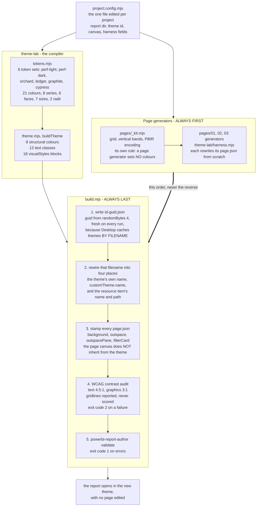
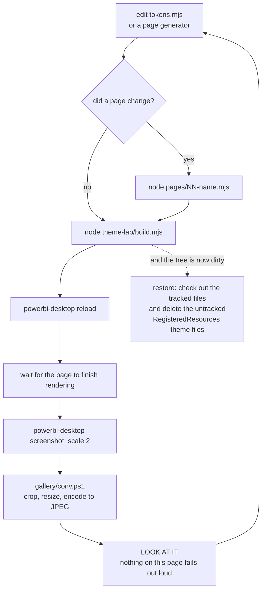
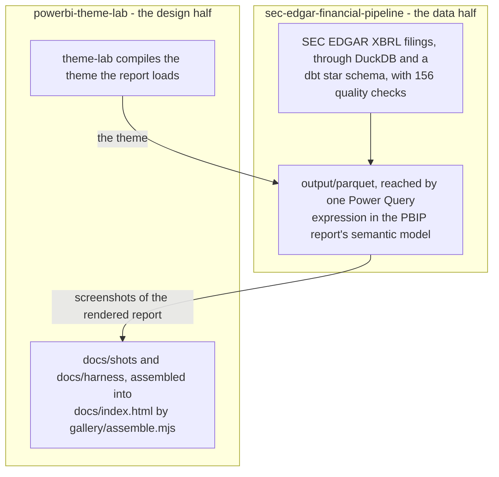
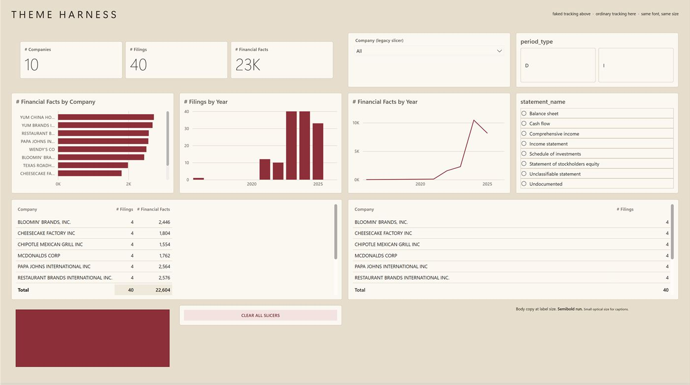
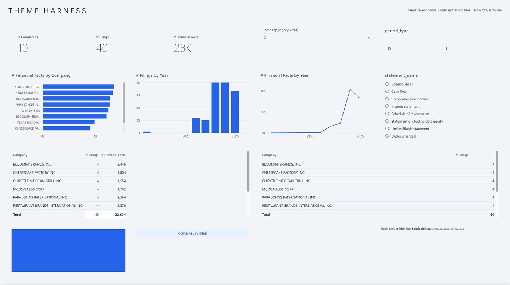
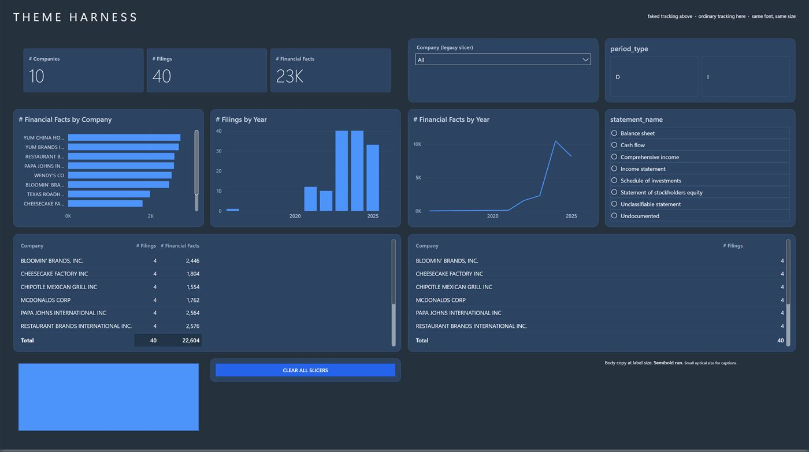
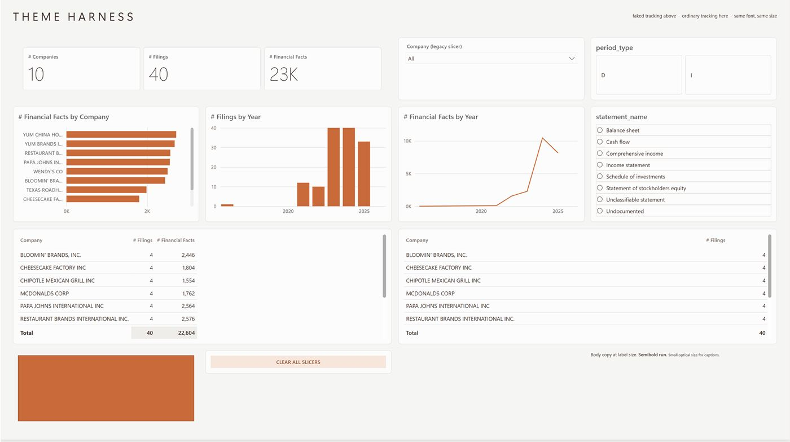
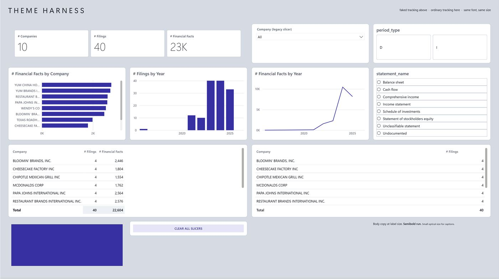
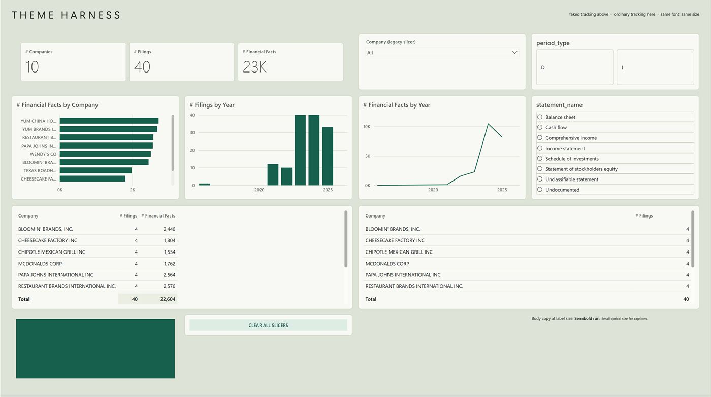

# How it works

Three diagrams and one strip of screenshots. Together they answer the two questions the gallery
raises and does not answer: what compiles what, and in which order the commands have to run.

Everything drawn below is checked against the code in this repository. Where a box names a file, a
flag or a count, that file, flag or count exists.

## 1. The compiler, and the lane beside it

`theme-lab/` is a compiler: design tokens in, a complete Power BI theme JSON out, with a WCAG
contrast audit on every colour pair it produces. Six token sets are defined, so the same report has
six sets of clothes and no page is ever edited to change between them.

Beside the compiler runs a second lane, the page generators, and the whole reason this diagram
exists is the thick arrow between them.

**Why the order is the point.** A page generator writes its `page.json` from scratch, and step 3
above is what puts the canvas colour into that same file. Run the generator after `build.mjs` and
the stamp is gone: the page then renders on Power BI's default grey, `validate` still reports zero
errors, and nothing anywhere says why. Generator first, `build.mjs` last, every time.

**What is committed here, and what is not.** `tokens.mjs` and `theme.mjs` are the compiler and they
run in this repository unaided. `build.mjs` and `harness.mjs` do not: they rewire a PBIR report, and
no report is committed here. The `pages/` lane belongs to the report's own repository for the same
reason. That is also why `project.config.mjs` sits beside `theme-lab/` rather than inside it -
nothing report-specific is allowed to live in the folder that gets copied between projects.

## 2. The loop this is worked in

Changing a colour is one edit and five commands. The last step is the one that matters, and it is
not a command.

**The wait is not padding.** A matrix and a table are the slowest visuals on a page, and a
screenshot taken too soon after a reload catches them mid-render: the rows are there but washed out,
or the visual is still blank. The file is written, the command reports success, and the picture is
wrong. Half of a first pass at the strip below was lost to exactly this.

**The restore is not optional either.** The theme filename carries a fresh random GUID on every
build, so *every* build rewrites `report.json` even when no token changed. A plain rebuild does not
put the tree back; only checking the tracked files out and deleting the untracked theme files does.

## 3. Where the numbers come from

Two repositories, two disciplines. This one is about how a report is dressed. Whether the figures on
it are right is the other one's question, and it answers that at length - the full architecture is
linked, not repeated here.

The pipeline is at
[rdiguglielmo/sec-edgar-financial-pipeline](https://github.com/rdiguglielmo/sec-edgar-financial-pipeline).

## The harness page

The gallery shows a designed report. This shows the test surface underneath it: one visual of every
type worth theming, on a single page, with real data and **no inline colour overrides anywhere**.
That last rule is what makes it useful. If a single colour on this page were set by hand, the page
would stop telling the truth the moment a theme was swapped.

Fourteen visuals: a multi-value card, three slicers of three different generations, a bar, a column
and a line chart, a matrix, a table, a shape, a button, and three runs of type at different optical
sizes. Every figure is identical across the six - ten companies, forty filings, 22,604 facts. The
only thing that moves is the palette.

| | | |
|---|---|---|
| **Ledger** - 16.16:1, the one that shipped | **Performance Light** - 13.43:1 | **Performance Dark** - 9.19:1 |
|  |  |  |
| **Orchard** - 12.51:1 | **Graphite** - 17.79:1 | **Cypress** - 16.13:1 |
|  |  |  |

The ratio beside each name is primary text against the panel colour, computed with the WCAG formula.
It is the same number the audit inside `build.mjs` prints on every build.

Performance Light is worth a second look: its ground, its panels and its rules are all the same
grey, so panels are separated by space alone. That is a deliberate token choice, not a missing
border, and the harness is where it was settled.

**These six are not gallery pages, and they live apart from them.** `gallery/assemble.mjs` walks
exactly six themes by three numbered pages and stops with an error if one of the eighteen files is
missing. The harness has no page number and is not compared against pages 01 to 03, so it sits in
`docs/harness/` rather than `docs/shots/`, where the generator would not expect it.
